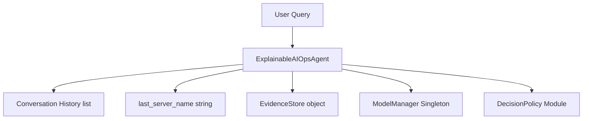
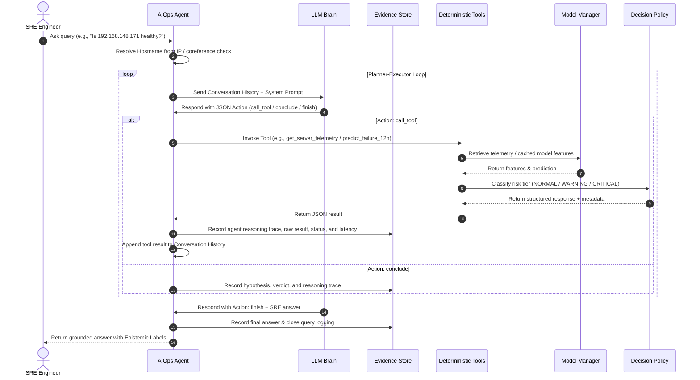

# Explainable AIOps Agent Architecture & Pipeline

This document explains where the agent's memory is stored, how the processing pipeline operates, how models and decision policies are managed, and how actions are explained and traced.

---

## 1. State & Memory Tracking

The agent maintains two forms of memory during runtime, managed entirely inside the [ExplainableAIOpsAgent](file:///c:/Users/navad/ML_data/aiops_agent/agent.py#L181) instance:



### A. Conversation History (`self.conversation_history`)
* **Type:** `list[dict]` (e.g., `[{"role": "user", "content": "..."}, {"role": "assistant", "content": "..."}]`)
* **Storage Location:** Kept in RAM for the lifetime of the agent session.
* **Purpose:** Provides the LLM with conversational context across turns. When a tool finishes execution, its output is appended to this list to allow the LLM to inspect the evidence.

### B. Coreference State (`self.last_server_name`)
* **Type:** `str` (or `None`)
* **Storage Location:** RAM.
* **Purpose:** Remembers the last successfully queried host (e.g., `v5G-AMF-01`). If a subsequent query uses terms like *"Why did it fail?"* or *"Check its memory status"*, the agent automatically injects `[Context: The most recently discussed server is '...']` into the prompt before calling the LLM.

### C. Audit Trail / Evidence Store (`self.evidence`)
* **Type:** [EvidenceStore](file:///c:/Users/navad/ML_data/aiops_agent/evidence_store.py#L23) instance.
* **Storage Location:** RAM. Reset at the start of each query, with session metrics logged to `self.evidence.query_log`.
* **Purpose:** An immutable ledger of every step in the agent's reasoning loop. Every entry tracks:
  * The agent's exact reasoning trace.
  * The tool called and arguments passed.
  * The exact raw JSON evidence returned.
  * Exact latency (in milliseconds) and execution status (`SUCCESS` or `ERROR`).
  * Intermediate conclusions or verdicts.

### D. Model Manager & Decision Policy
* **ModelManager:** Singleton runtime cache (`[ModelManager](file:///c:/Users/navad/ML_data/aiops_agent/model_manager.py)`) that loads pre-trained `.joblib` models (Isolation Forest, XGBoost 12h/24h) and the `server_history.parquet` telemetry table into RAM at initialization. Eliminates disk I/O during tool execution.
* **DecisionPolicy:** Standardized rule engine (`[DecisionPolicy](file:///c:/Users/navad/ML_data/aiops_agent/decision_policy.py)`) that converts continuous anomaly scores and failure probabilities into discrete operational risk tiers (`NORMAL`, `WARNING`, `CRITICAL`).

---

## 2. Processing Pipeline

The agent runs a dynamic, multi-turn reasoning loop capped at `MAX_AGENT_STEPS` (default: 8).



### Stage 1: Input Analysis & Context Injection
1. The SRE enters a query.
2. The agent inspects if the query contains an IP address. If so, the planner calls `find_server_by_ip` first to resolve the hostname (`192.168.148.171` -> `v5G-NRF-Edge-08`).
3. The query is enriched with the active `last_server_name` context to resolve pronouns.

### Stage 2: Reasoning & Execution Loop
1. **Plan:** The LLM receives the system prompt (rules, tool descriptions, selectivity guidelines) and the message history. It decides what information it needs next and calls a tool.
2. **Execute:** The agent intercepts the `call_tool` request, executes the corresponding Python function in [tools.py](file:///c:/Users/navad/ML_data/aiops_agent/tools.py), captures execution metrics, and sends the raw result back to the LLM.
3. **Conclude:** The LLM reads the tool output. If the information suggests a specific state, it may declare a hypothesis `conclude` (e.g., `"The server has missing sensors" -> ACCEPTED`) to anchor its reasoning trace.
4. **Trigger Rules:** If an XGBoost prediction returns a `WARNING` or `CRITICAL` risk tier via `DecisionPolicy`, the system prompt's *SHAP Auto-Trigger Rule* instructs the LLM to call `explain_prediction` before delivering the final response.

### Stage 3: Synthesis & Grounding
1. Once all necessary data is in the conversation history, the LLM outputs a `finish` action containing the final answer.
2. The answer is parsed and verified for grounding. Every claim must belong to one of four labels:
   * `[EVIDENCE]`: Raw facts derived directly from a tool output.
   * `[CONCLUSION]`: Logical deductions combining evidence.
   * `[RECOMMENDATION]`: SRE-actionable steps.
   * `[ASSUMPTION]`: Unverified hypotheses (noting low confidence).
3. The response is output to the user, and the session's latency, tool usage, and error statistics are logged to the `EvidenceStore`.

---

## 3. Failure Handling & Production Safeguards

To ensure production-grade reliability in enterprise AIOps environments, the agent implements multi-layered error handling, schema enforcement, and graceful fallback behavior:

```mermaid
graph TD
    ToolCall[Tool Invocation] --> RetryCheck{Execution Success?}
    RetryCheck -- No --> ExponentialBackoff[@with_retry decorator]
    ExponentialBackoff --> RetryCheck
    RetryCheck -- Max Retries Exceeded --> GracefulCatch[Catch Exception & Return Structured Error JSON]
    GracefulCatch --> AgentRecovery[Agent logs error to EvidenceStore & adjusts reasoning trace]
    
    DataIngest[Feature Extraction] --> SchemaCheck{Matches feature_order.json?}
    SchemaCheck -- No --> SchemaAlign[Automated Feature Imputation & Reordering]
    SchemaAlign --> Prediction[Inference Engine]
    SchemaCheck -- Yes --> Prediction
```

### A. Tool Failure & Retry Logic (`@with_retry`)
* **Mechanism:** Every deterministic tool function in [tools.py](file:///c:/Users/navad/ML_data/aiops_agent/tools.py) is wrapped in the `@with_retry(max_retries=2, delay=0.5)` decorator.
* **Behavior:** If a temporary I/O issue, telemetry timeout, or lookup failure occurs during tool execution, the decorator automatically retries up to 2 times using exponential backoff.
* **Graceful Degradation:** If the failure persists after all retries, the tool catches the exception instead of crashing the agent pipeline. It returns a structured error payload:
  ```json
  {
    "error": "Failed after 2 retries: Hostname 'v5G-INVALID' not found in server history.",
    "status": "ERROR"
  }
  ```
  The agent records this failed attempt in its `EvidenceStore` reasoning trace and informs the user transparently without halting execution.

### B. Schema Validation & Alignment (`feature_order.json`)
* **Mechanism:** All machine learning models require strict 15-feature numeric vectors aligned with [feature_order.json](file:///c:/Users/navad/ML_data/aiops_agent/models/metadata/feature_order.json).
* **Behavior:** When `predict_failure_12h`, `predict_failure_24h`, or `explain_prediction` are invoked, `ModelManager` verifies that the extracted row contains all required features in the exact expected sequence.
* **Safeguards:** Missing or `NaN` values are safely imputed or preserved according to model training conventions (`-1` for missing hardware status sensors), preventing shape mismatches and silent feature drift.

### C. Configurable Dual-Mode Display & Data Freshness (`config.py`)
To provide both clean assignment/interview demonstrations and production-grade monitoring without cluttering user responses, display behavior is toggled via feature flags in [config.py](file:///c:/Users/navad/ML_data/aiops_agent/config.py):
* **`SHOW_DATA_FRESHNESS = False` (Demo Mode):** Suppresses the `data_staleness_warning` from user-facing responses. Because historical datasets naturally exceed live time horizons (e.g., 278 hours old), hiding this warning keeps the demonstration focused entirely on anomaly detection, failure prediction, and SHAP explainability. Setting `SHOW_DATA_FRESHNESS = True` in live environments activates automatic confidence degradation when telemetry exceeds `STALE_DATA_THRESHOLD_HOURS`.
* **`SHOW_ADVANCED_METADATA = False` (Demo Mode):** Keeps internal execution details (`model_version`, `decision_threshold`, `prediction_timestamp`, `inference_latency_ms`) out of the user-facing answer. Instead, `EvidenceStore.record()` captures these details under `audit_metadata` in the internal ledger, ensuring 100% traceability and compliance under the hood without overwhelming SRE operators with JSON noise.
